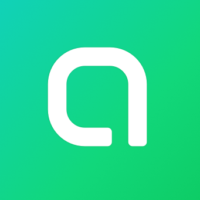
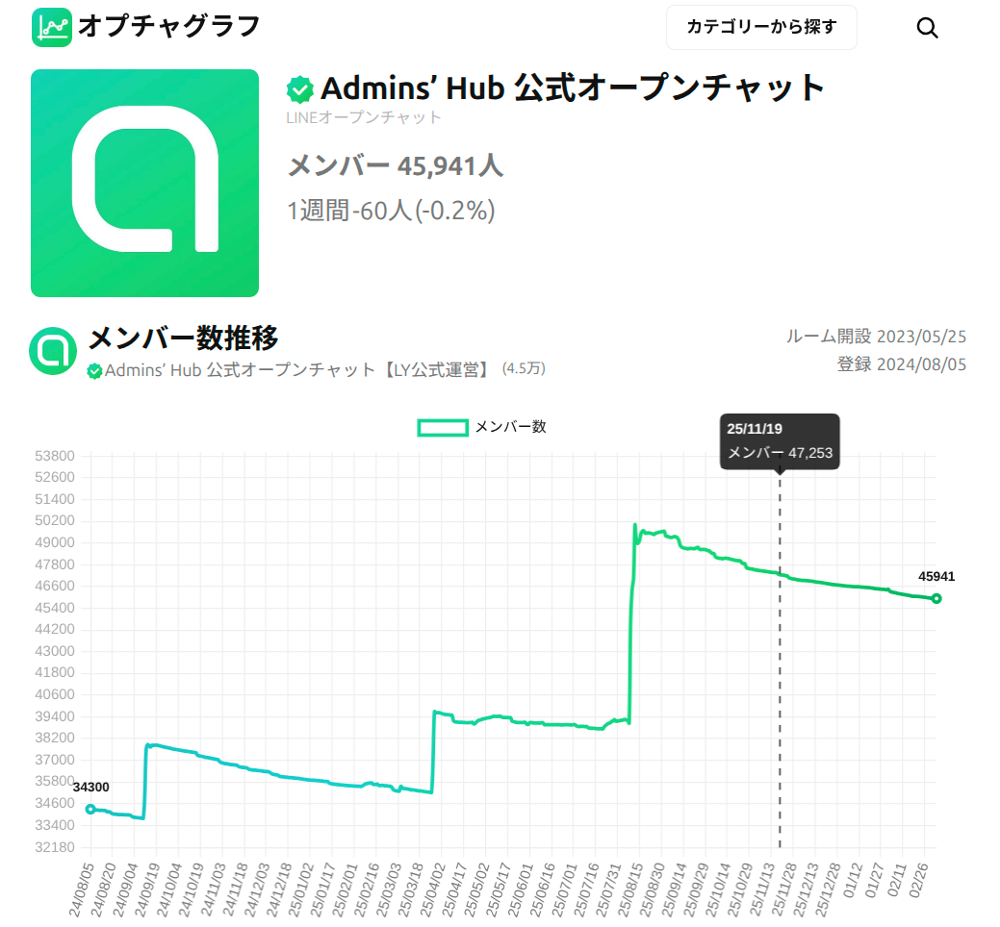

<!-- HTML生成: npx @marp-team/marp-cli --no-stdin phperkaigi2026/slides.md --html -o phperkaigi2026/slides.html -->

<!-- _class: profile -->

<div class="left">

<div class="name">pika | keita nemoto</div>
</div>

<div class="right">

## 所属


デジタルサーカス株式会社
エンジニア歴 1年半
プログラミング歴 3年半

</div>

<!--
「pikaです。デジタルサーカスでエンジニアをしています。プログラミング歴は3年半です」
-->

---

<!-- _class: big -->

## LINEオープンチャットの部屋の評判を
## ユーザーが自由に投稿できるサービスを作りたかった
<div style="position: absolute; bottom: 60px; left: 60px; display: flex; align-items: flex-start; gap: 16px;">

<span style="font-size: 1.5rem; text-align: left;">LINEオープンチャットは<br>LINEアプリの匿名グループチャット機能です！</span>
</div>

<!--
「LINEのオープンチャットの評判を、ユーザーが自由に投稿できるサービスを作りたかったんです」
-->

---

<!-- _class: big -->

## WordPressでやってみた

### でも思いどおりのカスタマイズができなかった

<!--
「最初はWordPressとプラグインを組み合わせてやってみたんですが、思いどおりのカスタマイズができなかったんです」
-->

---

<!-- _class: big -->

## 自分で作るしかない

### Progateでプログラミングを始めた

<!--
「自分で作るしかないと思って、Progateでプログラミングを始めました」
-->

---

## 一応動くものは作れた

```php
class PostReview extends ApiAbstract
{
    public function __construct()
    {
        $this->init($this->validation(), ...);
        $insert_db = new InsertDB($this->sql);
        $result = $this->add($insert_db, $post_value);
        httpResponse(200, 'OK');
    }
}
```

でもコンストラクタに全部詰め込んでいた

<!--
「一応動くものは作れたんですが、コンストラクタに処理を全部詰め込んでいて、機能を追加するたびにコードがどんどん複雑になり開発が困難になっていきました」
一拍
-->

---

<!-- _class: big -->

## どこに何を書けばいいか分からない

### 何度も最初からやり直した

<!--
「どこに何を書けばいいか、分からなかったんです」
黙る。読ませる。
「何度も最初からやり直しました」
★急がない
-->

---

<!-- _class: big -->

## 関数やクラスに切り出してみたけど

### いろんな箇所から参照されて、変更すると何が壊れるか分からなくなった

<!--
「関数やクラスに切り出してみたんですが、いろんな箇所から参照されるようになって、変更すると何が壊れるか分からなくなりました」
-->

---

## クラスが増えるとnewで全部繋がないといけない

```php
$db = new Database();
$store = new ImageStore($db);
$controller = new ImageController($store);
```

<!--
「クラスが増えてくると、newで全部自分で繋がないといけなくなりました」
-->

---

<!-- _class: big -->

## どう整理すればいいか調べた

### Laravelの記事ばかり出てきた

<!--
「どう整理すればいいか調べたら、Laravelの記事ばかり出てきたんです」
-->

---

<!-- _class: big -->

## 既存のフレームワークやライブラリを使いたくない

### 謎の厨二病にかかっていた

<!--
「でも当時は既存のフレームワークやライブラリを使いたくない、謎の厨二病にかかっていたんです。Laravelは一見して複雑そうで覚えるのがめんどくさそうだと思っていました。今はLaravelの良さもわかりますが、当時はそう思っていました」
-->

---

## でもLaravelのコントローラを見て思った

```php
// Laravelのコード: 引数に型を書くだけで使える
public function index(ImageStore $store) { ... }
```

これは便利だ。自分でも作りたい

<!--
「そこでLaravelのコントローラを見たら、引数に型を書くだけでクラスが使えるようになっていたんです。これは便利だなと」
-->

---

<!-- _class: big -->

## Laravelの書き方だけ真似して
## 裏側は全部自分で作ることにした

<!--
「だからLaravelの書き方だけ真似して、裏側は全部自分で作ることにしました」
-->

---

<!-- _class: big -->

## ルーティングも自動インスタンス化もセキュリティも

### 欲しい機能はすべて原理を調べて一から実装した

<!--
「ルーティングも自動インスタンス化もセキュリティ対策も、欲しい機能はすべて原理を調べて一から実装しました」
-->

---

<!-- _class: title -->

# できた

ルーティングと自動インスタンス化 / バリデーション
CSRF対策 / 自動XSSエスケープ / ヘルパー関数 / ファサード
クッキー / セッション管理 / Requestオブジェクト

外部ライブラリ依存ゼロ

<!--
「で、できました」
止まる。読ませる。「外部依存ゼロ」は口で言わない。
-->

---

### こう定義すると

```php
Route::path('image/store@post')            // POST /image/store
    ->matchFile('file', ['image/jpeg'])    // 画像だけ許可
    ->matchNum('imageSize', max: 1000);    // 数値の範囲チェック
```

### このコントローラが呼ばれる

```php
class ImageApiController
{
    public function store(
        GdImageFactoryInterface $image,  // 自動で生成される
        ImageStoreInterface $store,      // 自動で生成される
        array $file,                     // バリデーション済み
        int $imageSize                   // バリデーション済み
    ) {
        // やりたいことだけ書く
```

<!--
「こう定義すると、このコントローラが呼ばれます。クラスは自動でインスタンス化されて、値はバリデーション済み。やりたいことだけ書けばいい」
一拍
-->

---

<!-- _class: big -->

## 後から知ったんですが

<!--
「……後から知ったんですが」
黙る。★急がない
-->

---

<!-- _class: big -->

## 「設定より規約」と呼ばれていた

### Convention over Configuration
### 決められた場所に決められた書き方で置けば動く

<!--
「決められた場所に決められた書き方で置けば動く。これは設定より規約と呼ばれていました」
-->

---

<!-- _class: big -->

## 「依存性の注入」と呼ばれていた

### Dependency Injection
### クラスを手動でインスタンス化して渡していた問題の答え

<!--
「クラスを手動でインスタンス化して渡していた問題の答えは、依存性の注入と呼ばれていました」
淡々と
-->

---

<!-- _class: big -->

# 問題が、設計を導いた

問題を持っていたから、設計に辿り着いた

<!--
「問題を持っていたから、設計に辿り着けたんです」
一拍。「問題が、設計を導いた」はっきり。★2回目
-->

---

<!-- _class: profile-product -->

<div class="product-area">

<div class="product-info">

## このフレームワークで
## オプチャグラフを作って公開した

LINEオープンチャットの
グラフ可視化ツール

月間アクティブユーザー 約2万人
月間PV 約10万

コントローラ 41個 / モデル 145個
コミット 3,300+ / PR 233本

</div>
</div>

<!--
「このフレームワークでオプチャグラフを作って公開しました。今も動いています」
-->

---

<!-- _class: big -->

## 問題を持っていれば、答えに辿り着ける

### 皆さんもぜひ、自分の手で作ってみてください

ありがとうございました

<!--
「問題を持っていれば、答えに辿り着けます。皆さんもぜひ自分の手で作ってみてください。ありがとうございました」
-->
